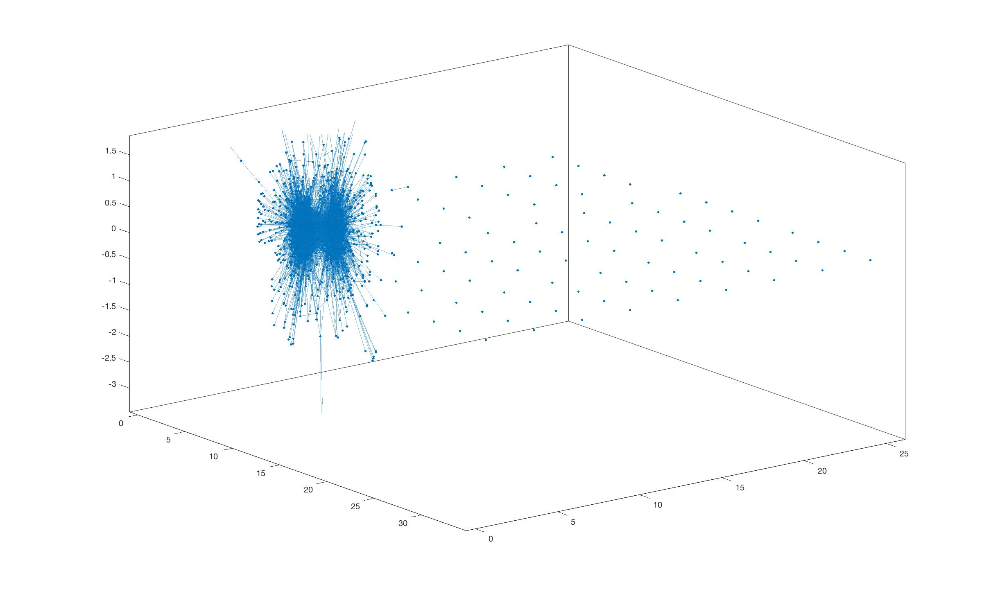

# Partitioning a network of US political blogs
This is a study on network partitioning using the Spectral Modularity Maximization algorithm. 

## Problem Statement
In this problem I have studied a network of Internet blogs on the subject of US politics, with the goal of partitioning the graph into liberal (i.e., Democrat) and conservative (i.e., Republican) ‘blogger communities’.

## Dataset
Data on the 2004 US Election’s political blogosphere was compiled by L. Adamic and N. Glance in 2005, and can be obtained e.g., from Mark Newman’s network collection at http://www-personal.umich.edu/∼mejn/netdata/. Here we use an undirected version of the original directed graph, where edges correspond to hyperlinks between blogs. The network comprises N_v = 1490 blogs (vertices), and a binary attribute associated to each vertex indicates political leaning according to: 0 (liberal) and 1 (conservative). Matrix A ∈ {0, 1} is the graph’s adjacency matrix, whereas the vector nodes ∈ {0, 1} contains the binary vertex attributes indicating political leaning of each blog. The data file is included in this repository.

## Implementation

## Installation and Usage
The scripts do not use any library beyond the default installations on MATLAB. Please run the main_.m script from the MATLAB interface, which will construct the desired plots.

## Outputs

